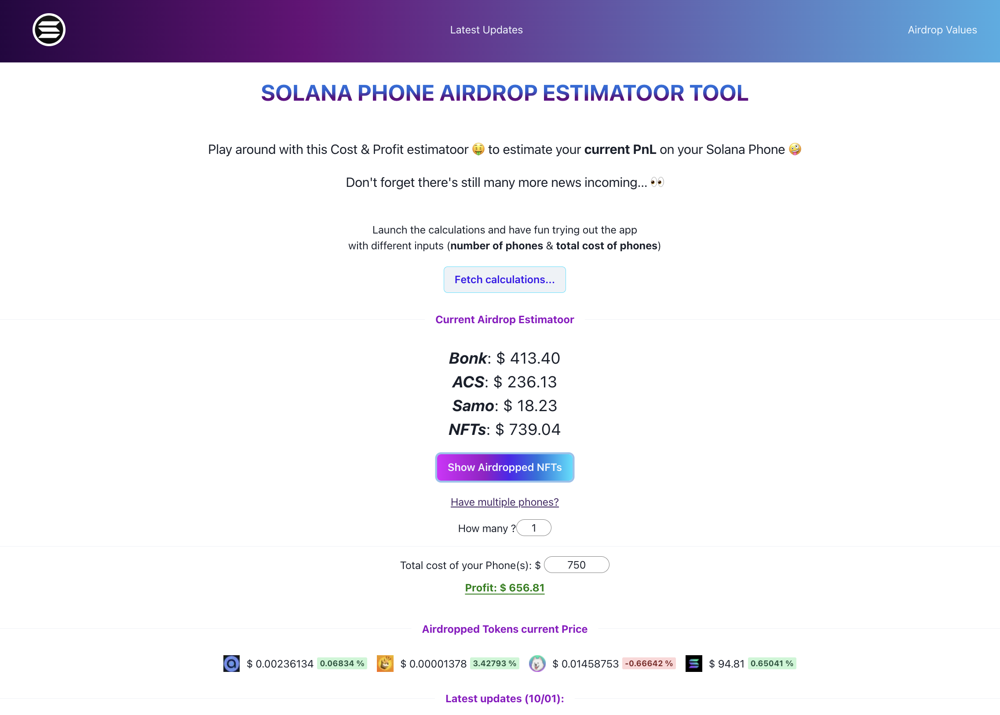
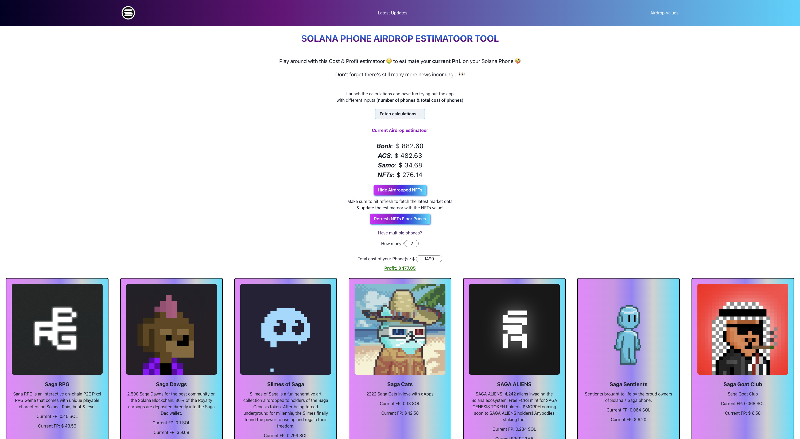

<h1>SolPhoneHub: For all your Solana Saga Needs</h1>

The web app can be accessed here: <a href="https://sol-phone-hub.vercel.app/airdrops">SolPhoneHub</a>

v0.1 - 04/01/24 - Initial launch version of the Hub - Accounts for $BONK & $ACS Airdrop

 

v0.2 - 10/01/24 - Added support for airdropped NFTs to be added in total value estimatoor

 

v0.2.1 - 15/01/24 - Added support for additional NFT collections & backend built

<h2>Open-Source built with 💜 </h2>

Open-sourcing and centralizing all the information on the Solana Saga mobile phone updates to keep the community updated on the latest announcements and news ongoing with the Saga ownership.
Feel free to leave your feedback and/or commiting directly to the project

<h6>Disclaimer</h6>

This project was built as a passionate side hustle to keep me training with programming and it is in no way a financial advice nor endorsement of any investment strategy. Be safe and make your own decisions

